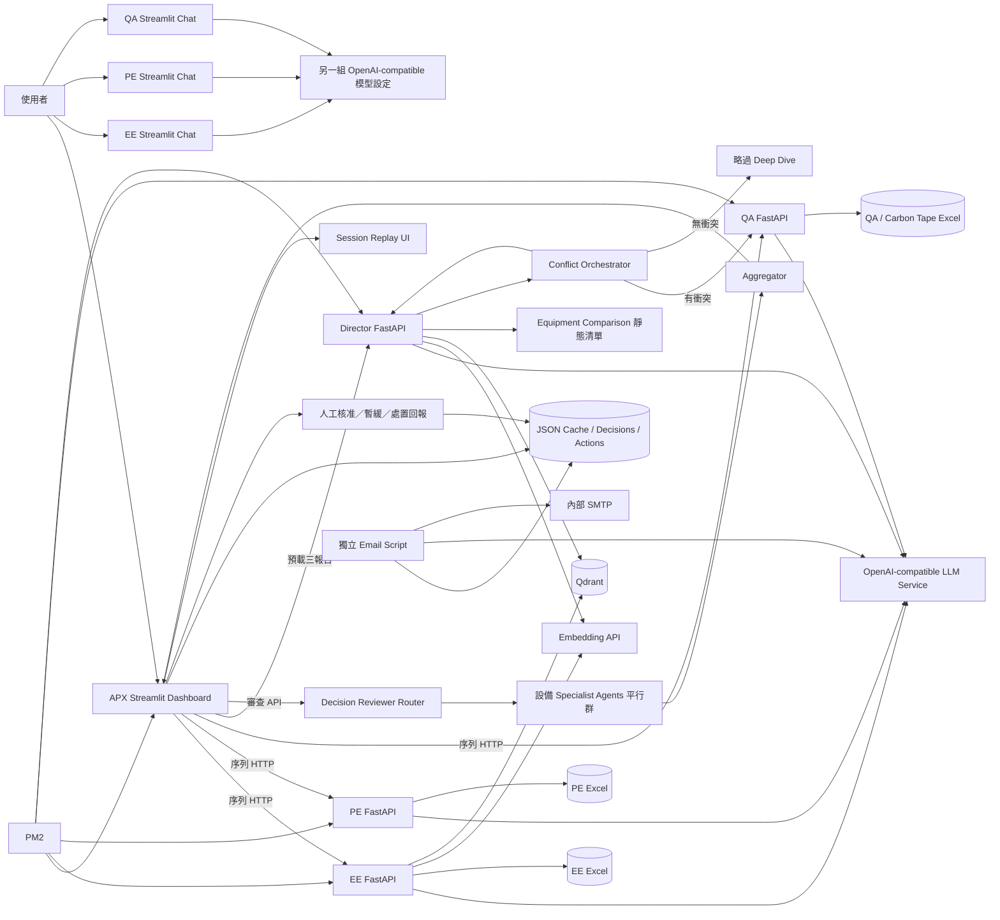

# APX Agent 系統架構盤點與工程機制稽核

- 稽核日期：2026-08-21
- 稽核範圍：Repository 內 12 個 Python 程式、PM2 設定、3 個 JSON 狀態／快取檔、1 個既有 log 與資產目錄
- 稽核方式：靜態程式碼與設定檔逐檔追蹤；未啟動內部服務、未修改既有程式碼、未驗證 Repository 外部資料檔或服務的實際可用性
- 敏感資訊處理：本報告不揭露 API Key、Token、內部帳號、收件者或內部主機位址；只記錄其儲存方式與風險
- 判定尺度：已具備／部分具備／未具備／無法確認／不適用

## 0. 稽核範圍與 Repository 盤點

### 0.1 實際檔案

| 類型 | 檔案 | 實際角色 |
|---|---|---|
| 主儀表板 | [APX_Agent_UI.py](APX_Agent_UI.py) | Streamlit 週報儀表板、API 串接、快取、Trace Replay、人工決策與 Action 回報 |
| EE API | [EE_Agent_api.py](EE_Agent_api.py) | FastAPI + OpenAI Agents SDK；EE 報告與對話 |
| PE API | [pe_agent_api.py](pe_agent_api.py) | FastAPI + OpenAI Agents SDK；PE 週報、對話、SSE |
| QA API | [qa_agent_api.py](qa_agent_api.py) | FastAPI + OpenAI Agents SDK；QA 週報、對話、Deep Dive |
| Director API | [executive_agent_api.py](executive_agent_api.py) | FastAPI；整合報告、RAG、衝突調度與 Reviewer API |
| Orchestrator | [conflict_orchestrator.py](conflict_orchestrator.py) | Pydantic State、EE/PE 衝突規則、條件式 QA Deep Dive |
| Reviewer | [decision_reviewer_swarm.py](decision_reviewer_swarm.py) | Python Router、設備專家平行審查、Aggregator 與 fallback |
| 獨立 EE UI | [EE_agent_app.py](EE_agent_app.py) | Streamlit 互動 Agent；與 EE API 有重複但不同的模型設定與工具集 |
| 獨立 PE UI | [pe_agent_app.py](pe_agent_app.py) | Streamlit 互動 Agent；與 PE API 有重複但不同的模型設定與工具集 |
| 獨立 QA UI | [qa_agent_app.py](qa_agent_app.py) | Streamlit 互動 Agent；與 QA API 有重複程式碼 |
| 決定式工具 | [equipment_comparison.py](equipment_comparison.py) | 內嵌 Cayman/AMD 機台清單與差異規則，輸出 Markdown |
| 郵件程式 | [send_dir_agent_report_v3.py](send_dir_agent_report_v3.py) | 獨立讀取快取、LLM 摘要／轉 HTML、SMTP 發送 |
| 部署設定 | [ecosystem.config.js](ecosystem.config.js) | PM2 啟動 4 個 API、4 個 Streamlit UI，另含 Repository 外的 OOS API |
| 持久化資料 | [analysis_results_cache.json](analysis_results_cache.json) | 週別 Agent 報告、Trace、決策與 Action 狀態 |
| 持久化資料 | [weekly_data_cache.json](weekly_data_cache.json) | AMD Yield 與 KPI 週資料快照 |
| 回饋資料 | [chat_feedback.json](chat_feedback.json) | Dir Chat 成功問答附加紀錄；未見後續訓練／Prompt 更新消費者 |
| Log | [logs/ee_agent_debug.log](logs/ee_agent_debug.log) | EE Streamlit 的本機文字除錯 log |
| 資產 | [assets/APX_Agent_icon.png](assets/APX_Agent_icon.png) | UI 圖示 |

### 0.2 未找到的工程資產

搜尋 Repository 後未找到 README、requirements.txt、pyproject.toml、Pipfile、Poetry/uv lock、Dockerfile、Compose、Kubernetes manifest、.env 範本、.gitignore、測試目錄、CI/CD pipeline、migration 或正式操作手冊。因此：

- 套件版本、完整可重建環境：**無法確認**。
- Container 化、不可變部署、Dev/Prod 映像分離：**未具備**。
- 自動化測試與發版閘門：**未具備**。
- 若其他外部文件宣稱上述機制存在：**Repository 內未找到程式碼或設定證據**。

---

## 1. Executive Summary

### 1.1 系統定位

目前系統不是「只呼叫一次 LLM」的單一應用；它已形成一套由 EE、PE、QA、Director、Conflict Orchestrator、設備 Reviewer 與人工審核組成的 **多角色 Agent Workflow**。然而，核心週報仍是固定順序的服務串接；只有衝突追查與 Reviewer 分組具有條件路由／平行節點，且缺少跨節點統一執行引擎、持久化 Graph State、品質失敗後自動重產及 Production 級治理。因此較準確的分類是：

> **具多 Agent 元件的固定工作流，局部具有 Agent Graph 特徵；尚非完整、可恢復、可治理的 Multi-Agent Graph Platform。**

### 1.2 五面向結論

| 面向 | 結論 | 分數 |
|---|---|---:|
| Harness Engineering | **部分具備**：有角色 Prompt、工具白名單、RAG、Pydantic API Schema、timeout、fallback 與快取；但設定／秘密分散、無 Auth、無 retry/backoff/concurrency guard、無 Prompt Injection 防護 | 3/5 |
| Loop Engineering | **部分具備（偏弱）**：Agents SDK 能進行 tool-call 多輪，另有人工核准與 Action 回報；但沒有「驗證失敗→依原因修正→再驗證」的自動品質閉環 | 2/5 |
| Graph Engineering | **部分具備**：有確定性 Router、條件式 QA Deep Dive、Reviewer 平行 fan-out/fan-in；但主鏈為序列 Pipeline，沒有通用 Graph runtime、checkpoint、resume 或節點級 retry | 3/5 |
| Observability | **部分具備**：各主要 API 有本地 trace、工具 latency 與 UI Session Replay；但 trace ID 不一致、Langfuse 關閉、無 token/cost/metrics/alert、無跨服務完整關聯 | 2/5 |
| Governance | **部分具備（偏弱）**：有設備 Reviewer、人工核准、週次快取與 Action 歷程；但硬編碼秘密、無 API 權限、Prompt/模型/資料無正式版本、無保留／刪除政策 | 2/5 |

### 1.3 最重要的三項優勢

1. **工具與資料職責已有邊界**：EE、PE、QA 各自以明確 Prompt 與工具白名單操作不同資料來源，例如 [EE Agent 工具清單](EE_Agent_api.py#L1406-L1467)、[PE Agent 工具清單](pe_agent_api.py#L518-L535)、[QA Agent 工具清單](qa_agent_api.py#L956-L984)。
2. **局部 Graph 行為是真實實作而非命名**：衝突為 $PE\setminus EE$ 的確定性規則，命中後才進 QA Deep Dive；見 [detect_conflicts](conflict_orchestrator.py#L332-L368) 與 [條件路由](conflict_orchestrator.py#L508-L545)。Reviewer 依設備類型分組後 `asyncio.gather` 平行審查，再 fan-in；見 [run_review_swarm](decision_reviewer_swarm.py#L752-L843)。
3. **已有人工決策與處置回報**：UI 支援核准、暫緩、重複暫緩提醒、Action owner/status/notes/time 保存；見 [人工審核區](APX_Agent_UI.py#L2383-L2520)。

### 1.4 最重要的三項缺口

1. **安全基線不足**：多個檔案將 LLM/Langfuse 憑證設為原始碼預設值；API 無驗證，部分服務 wildcard CORS；例如 [Director 模型設定](executive_agent_api.py#L41-L63) 與 [CORS](executive_agent_api.py#L857-L863)。
2. **沒有真正的內容品質修正閉環**：Reviewer 只審查一次並直接覆蓋 Section 4；Aggregator 不合法時改用 Python 組裝，並不把錯誤原因退回 Director 重產；見 [Aggregator fallback](decision_reviewer_swarm.py#L795-L836) 與 [一次回填](decision_reviewer_swarm.py#L849-L880)。
3. **不可端到端追蹤與重現**：只有 QA 產生局部 request ID；其他服務無共同 trace ID，Langfuse 被關閉，未保存模型版本、Prompt hash、token、成本或資料版本，無法精確重播同一決策。

---

## 2. 系統架構總覽

### 架構圖證據與邊界

- UI 的 EE→PE→QA→Director 是**序列**函式呼叫，不是並行；見 [_load_or_build_week_analysis_bundle](APX_Agent_UI.py#L177-L233)。
- Orchestrator 不是 UI 直接呼叫，而是 Director 快速端點內呼叫；見 [generate_weekly_decision_fast](executive_agent_api.py#L1083-L1140)。
- Orchestrator 的完整獨立路徑可平行取 EE/PE，但主 UI 採用的是「從預載報告解析」路徑；見 [orchestrate_full_pipeline](conflict_orchestrator.py#L460-L562) 與 [run_conflict_detection_from_reports](conflict_orchestrator.py#L571-L678)。
- Email 不在主 UI 自動流程內；它只在獨立 `main()` 中讀快取並發送，見 [mail main](send_dir_agent_report_v3.py#L447-L476)。
- PM2 還啟動一個 Repository 外的 OOS API；此元件以虛線「待確認」才合理，因本 Repository 無其程式碼。本圖未畫入，以避免把無法稽核元件當成已確認架構。

---

## 3. 系統元件盤點表

| 類型 | 元件 | 功能 | 實作位置 | 輸入 | 輸出 | 上下游關係 |
|---|---|---|---|---|---|---|
| UI | APX Dashboard | 週次選擇、良率/KPI、呼叫 Agent、Trace、人工審核 | [main dashboard](APX_Agent_UI.py#L2100-L2520) | 使用者週次、Rerun、人工狀態 | 圖表、報告、決策、JSON 狀態 | 上游 Excel/KPI/API；下游人員與 cache |
| API/Agent | EE Agent | Yield/Rework 熱點、CIP 案例 | [create_ee_agent](EE_Agent_api.py#L1406-L1467) | 週次或自然語言 | Markdown + trace | Excel、Embedding、Qdrant → UI/Director |
| API/Agent | PE Agent | 異常 Lot、良率與嫌疑機台 | [create_weekly_report_agent](pe_agent_api.py#L518-L535) | 日期、門檻、limit、note | Markdown + trace | PE Excel → UI/Director |
| API/Agent | QA Agent | 保養 KPI、軌跡、污染源 | [_create_qa_agent](qa_agent_api.py#L956-L984) | 週次、機台或 query | Markdown + trace | QA Excel → UI/Orchestrator/Director |
| API/Agent | Director | 三報告整合、會議紀錄、歷史週報 RAG | [_create_executive_agent](executive_agent_api.py#L805-L832) | 報告、週次、chat context/history | 決策報告 + trace | UI/Orchestrator/Qdrant → Reviewer/UI |
| Workflow | Conflict Orchestrator | $PE\setminus EE$ 衝突、QA 動態追查 | [schemas](conflict_orchestrator.py#L31-L110)、[routing](conflict_orchestrator.py#L571-L678) | 三部門報告、週次 | `OrchestrationResult` | Director ↔ QA |
| Reviewer | Router/Specialists/Aggregator | 依設備類型校驗 Section 4 | [router](decision_reviewer_swarm.py#L566-L631)、[swarm](decision_reviewer_swarm.py#L714-L880) | Dir Markdown Section 4 | 替換後 Markdown + stages/meta | Director API → UI |
| Tool | Historical Report RAG | Dense embedding + Qdrant filter/search | [query_weekly_report_context](executive_agent_api.py#L591-L679) | question/year_week/types/score | 相關片段文字 | Director tool |
| Tool | Meeting Action Items | Qdrant scroll + Python 去重 | [fetch_weekly_meeting_records](executive_agent_api.py#L488-L589) | week、collection、limit | JSON 文字 | Director tool |
| Tool | Equipment Comparison | 靜態集合運算與規則 | [compare_equipment](equipment_comparison.py#L155-L315) | 內嵌清單 | dict/Markdown | Director tool |
| 狀態 | Analysis Cache | 報告、trace、人工決策/Action | [load/save/upsert](APX_Agent_UI.py#L108-L176) | dict | JSON | UI 與獨立 mail |
| 觀測 | Trace Replay | 顯示工具/LLM 時序與步驟 | [_render_trace_timeline](APX_Agent_UI.py#L1240-L1344)、[_render_trace_panel](APX_Agent_UI.py#L1347-L1457) | trace events | Plotly/Streamlit | API trace → 工程人員 |
| Human | Decision Review UI | 核准、暫緩、Action 回報 | [review controls](APX_Agent_UI.py#L2383-L2520) | 人工點擊／輸入 | cache 狀態 | 人員 → JSON cache |
| Delivery | Mail Script | 快取→LLM 摘要/HTML→SMTP | [read cache](send_dir_agent_report_v3.py#L91-L132)、[main](send_dir_agent_report_v3.py#L447-L476) | 固定週次與 cache | Email | 獨立執行，非 UI 下游 |
| Deployment | PM2 | 啟動 API/UI | [ecosystem.config.js](ecosystem.config.js#L1-L53) | 絕對路徑 | Processes | Windows 主機 |

---

## 4. Agent 協作與資料流

### 4.1 主 Dashboard 的一次完整請求

1. **觸發**：使用者在 sidebar 選週次或按 Rerun；UI 先從 AMD Excel 建立結構化 `yield_data`，見 [週次與 yield_data](APX_Agent_UI.py#L2106-L2151)。
2. **快取判斷**：`_load_or_build_week_analysis_bundle()` 比對八個報告/trace key 與 `yield_signature`；命中即回傳，Rerun 則清 Streamlit function cache，見 [cache gate](APX_Agent_UI.py#L177-L201)。
3. **部門 Agent**：UI 依序呼叫 EE、PE、QA API；每次都等待前一個完成，見 [序列呼叫](APX_Agent_UI.py#L202-L204)。不存在 UI 層三者平行執行。
4. **Director**：UI 將三份報告送到 `/api/weekly-decision-fast`，見 [Director call](APX_Agent_UI.py#L205-L210) 與 [HTTP client](APX_Agent_UI.py#L1651-L1686)。若三份不齊，才走 `/chat`，要求 Agent 用 RAG 工具補齊，見 [fallback chat](APX_Agent_UI.py#L1689-L1723)。
5. **會議資料**：快速端點先查上一週 Action Items，見 [action items preload](executive_agent_api.py#L1108-L1121)。
6. **衝突偵測**：Director 呼叫 `run_conflict_detection_from_reports()`；EE/PE 風險機台由報告文字與 hint 規則抽取，見 [報告解析](conflict_orchestrator.py#L596-L616)。衝突規則是 PE 嫌疑但 EE 未標記，即 $PE\setminus EE$，並另外計算交集共識，見 [detect_conflicts](conflict_orchestrator.py#L332-L368)。
7. **條件路由**：有衝突時逐台呼叫 QA `/deep-dive`，失敗再改 `/chat`；無衝突略過，見 [deep dive fallback](conflict_orchestrator.py#L376-L457) 與 [from-reports route](conflict_orchestrator.py#L627-L652)。此處是**條件 Workflow**，但多台 deep-dive 使用 `for` 逐台處理，不是平行。
8. **結果彙整**：Director 將三份報告（各截斷 4,000 字）、衝突/QA 結果與會議紀錄（截斷 3,000 字）組成 prompt，再由 `_executive_agent` 合成，見 [_build_weekly_decision_prompt](executive_agent_api.py#L1023-L1074) 與 [Runner.run](executive_agent_api.py#L1167-L1171)。
9. **Reviewer**：UI 收到 Director 報告後，再呼叫 `/api/review-decision`；錯誤時保留原報告，見 [_apply_decision_review](APX_Agent_UI.py#L1597-L1644)。Reviewer 抽 Section 4、依設備類型分組，只有實際出現的類型才建立 coroutine 並平行執行；Aggregator 合併，格式不合法或例外則 Python fallback，見 [review swarm](decision_reviewer_swarm.py#L752-L843)。
10. **不通過後處理**：Reviewer specialist 可把單列標記為符合／已修正／違規已替換／未知，但**不會退回 Director、要求重產或第二次驗證**。報告 Section 4 直接被替換，見 [backfill](decision_reviewer_swarm.py#L545-L558) 與 [review_report](decision_reviewer_swarm.py#L849-L880)。
11. **保存與輸出**：UI 將四份報告、四份 trace、yield signature 寫入週次 JSON，見 [_upsert_cached_week_analysis](APX_Agent_UI.py#L142-L176)；人工核准／暫緩及 Action 狀態也寫同一檔案，見 [state persistence](APX_Agent_UI.py#L264-L316)。
12. **Email**：不在上述請求鏈。獨立 script 依固定週次讀 JSON，另呼叫不同模型做摘要／HTML，再透過 SMTP 發送，見 [mail settings](send_dir_agent_report_v3.py#L10-L24) 與 [main](send_dir_agent_report_v3.py#L447-L476)。

### 4.2 真正平行的工作

- `orchestrate_full_pipeline()` 可 `asyncio.gather` 平行 EE/PE；但主 Dashboard 的快速路徑不使用此 Stage 1，見 [parallel EE/PE](conflict_orchestrator.py#L482-L486)。
- Reviewer 只對本次出現的設備類型平行執行 specialist，見 [specialist gather](decision_reviewer_swarm.py#L784-L789)。
- 主 Dashboard 的 EE/PE/QA 呼叫、QA 多機台 Deep Dive、Director 與 Reviewer 均為序列階段。

---

## 5. Engineering 成熟度評估

| 面向 | 等級 | 成熟度分數 | 主要證據 | 主要缺口 |
|---|---|---:|---|---|
| Harness Engineering | 部分具備 | 3/5 | Agent Prompt+tools、Pydantic request/response、RAG、timeout、cache/fallback | 無 Auth/secret 管理、retry/backoff、輸出語意 schema、prompt injection 防護 |
| Loop Engineering | 部分具備 | 2/5 | SDK tool-call loop、SSE 空輸出補跑、人工審核與 Action 狀態 | 無內容品質自動反覆修正、無明示 max turns、無結果回饋至規則/知識庫 |
| Graph Engineering | 部分具備 | 3/5 | 條件式 QA route、Reviewer fan-out/fan-in、Pydantic orchestration state | 主鏈固定、無 graph runtime/checkpoint/resume、節點 failure policy 不一致 |
| Observability | 部分具備 | 2/5 | 本地 trace、tool latency、QA request ID、UI replay、cache | 無共同 trace ID、token/cost/metrics/alerts、Langfuse 關閉 |
| Governance | 部分具備 | 2/5 | Reviewer、人工核准、資料週次與更新時間、Action audit-like state | 硬編碼秘密、無認證/RBAC、無正式版本/保留政策/不可變稽核 |

### 分數說明

- Harness 達 3：核心上下文、工具與失敗處理已形成，但無法稱 Production 完整 Harness。
- Loop 僅 2：存在多輪 tool calling 與人工流程，但沒有「品質不合格時自動修正直到通過」。
- Graph 達 3：局部具有明確條件路由與 fan-out/fan-in，但整體不是通用 Agent Graph。
- Observability/Governance 各 2：已有可用雛形，但缺跨服務、資安、版本、指標與稽核完整性。

---

## 6. Harness Engineering 詳細稽核

| 檢查項目 | 判定 | 程式碼證據 | 現況說明 | 缺口 |
|---|---|---|---|---|
| System Prompt/角色 | 已具備 | [EE](EE_Agent_api.py#L1417-L1467)、[PE](pe_agent_api.py#L400-L516)、[QA](qa_agent_api.py#L900-L954)、[Director](executive_agent_api.py#L680-L803) | Prompt 內嵌，角色、格式、工具順序與限制具體 | 無外部版本、owner、approval、測試；API/UI 重複且漂移 |
| Context 建立 | 部分具備 | [UI yield context](APX_Agent_UI.py#L2132-L2151)、[Director prompt](executive_agent_api.py#L1023-L1074)、[chat history](executive_agent_api.py#L936-L1004) | 結構化 yield、報告、歷史對話與 Action Items 組裝 | 以字元硬截斷；無 token budget、摘要策略、來源優先級 |
| Context 更新/Memory | 部分具備 | [JSON cache](APX_Agent_UI.py#L108-L176)、[session state](APX_Agent_UI.py#L264-L291) | 週別持久化與 Streamlit session | 無跨使用者隔離、transaction/locking、正式 memory schema |
| RAG/知識庫 | 已具備 | [EE dense+sparse](EE_Agent_api.py#L402-L494)、[Director report RAG](executive_agent_api.py#L591-L679) | Embedding + Qdrant + metadata filters | EE 搜尋是否真正融合 dense+sparse需依函式結果；無評測、citation ID、資料版本 |
| 結構化資料工具 | 已具備 | [PE Excel schema check](pe_agent_api.py#L207-L240)、[QA sheets](qa_agent_api.py#L163-L203) | pandas 讀取固定 Excel 欄位 | 外部檔未納版控，更新與 provenance 無一致 manifest |
| Provider/Model 設定 | 部分具備 | [API model](executive_agent_api.py#L41-L51)、[EE UI model](EE_agent_app.py#L34-L37)、[mail model](send_dir_agent_report_v3.py#L10-L16) | OpenAI-compatible provider；API、獨立 UI、mail 使用不同模型設定 | 分散且不一致；多處硬編碼；無模型版本鎖定/環境 profile |
| Tool Calling | 已具備 | Agent `tools=[...]`：上述四個 create functions | Agents SDK 可多輪呼叫工具 | 未明示 max turns、工具成本/權限/side-effect 分級 |
| API timeout | 已具備 | [UI EE/PE/QA](APX_Agent_UI.py#L705-L724)、[PE](APX_Agent_UI.py#L1513-L1546)、[QA](APX_Agent_UI.py#L1562-L1594)、[Director](APX_Agent_UI.py#L1651-L1723) | 120–300 秒 timeout；Orchestrator 有 connect timeout | 值分散、長 timeout、無全鏈 deadline |
| Retry/backoff | 未具備 | Repository 搜尋未見通用 retry/backoff；HTTP 多為單次 `post` | QA Deep Dive 有替代端點，不是同操作 retry | 無 exponential backoff、jitter、retry budget/circuit breaker |
| Concurrency limit | 未具備 | [Reviewer gather](decision_reviewer_swarm.py#L784-L789) 無 semaphore | Reviewer 按類型平行 | 無 semaphore/rate limiter/queue/backpressure |
| Input Schema | 已具備 | [EE Pydantic](EE_Agent_api.py#L1470-L1484)、[Director Pydantic](executive_agent_api.py#L867-L922) | API 輸入型別、部分範圍約束 | 機台/週次多為自由字串；history dict 無角色 schema |
| LLM Output Schema | 部分具備 | Prompt 表格規範；[Reviewer format validator](decision_reviewer_swarm.py#L693-L703) | 多數輸出仍為 Markdown；Reviewer 只驗表頭存在 | 無 Pydantic structured output；無逐欄型別/完整性驗證 |
| 工具輸出驗證 | 部分具備 | Pydantic `OrchestrationResult` [schemas](conflict_orchestrator.py#L31-L110) | Orchestrator state 結構化 | Agent tool 多回傳 JSON 字串/Markdown，容易被模型誤解 |
| 權限/危險操作防護 | 未具備 | API 無 auth dependency；[wildcard CORS](executive_agent_api.py#L857-L863) | 工具主要讀取；人工按鈕寫本地 JSON | 無身份、RBAC、CSRF、角色核准或高風險二次授權 |
| 敏感資料保護 | 未具備 | 多個模型/Langfuse設定在原始碼設預設秘密，如 [Reviewer config](decision_reviewer_swarm.py#L41-L49) | 部分可由 env 覆寫 | 原始碼含秘密預設值；需撤銷輪替；本報告不揭露值 |
| Error/Fallback | 部分具備 | [UI API fallback strings](APX_Agent_UI.py#L725-L735)、[QA deep-dive fallback](conflict_orchestrator.py#L406-L457)、[Reviewer fallback](decision_reviewer_swarm.py#L795-L836) | 可保留頁面或改替代路徑 | 錯誤文字可能被當報告送入下游；缺 failure classification |
| 人工介入 | 已具備 | [approve/on-hold](APX_Agent_UI.py#L2429-L2450) | 核准、暫緩、Action 回報 | 無使用者身份、電子簽核、權限與不可否認性 |
| Dev/Prod 分離 | 未具備 | [PM2 absolute paths](ecosystem.config.js#L1-L53)，原始碼內有多組註解模型設定 | 只有一份設定混合現用/舊設定 | 無 environment-specific config、secret store、container/CI/CD |
| Prompt Injection 防護 | 未具備 | [Director 將 RAG/report 原文直接插 prompt](executive_agent_api.py#L1023-L1074)；[chat context](executive_agent_api.py#L967-L1004) | 未見不可信內容分隔規則、instruction hierarchy 或 sanitizer | 外部文件/RAG/user context 可影響 Agent 指令 |

### Harness 核心判斷

系統已超越單純 LLM 呼叫：它控制角色、工具與資料來源，也有 schema、timeout、trace 和 fallback；但因缺少安全、可靠度、版本與統一設定控制，只能判定為 **部分具備 Harness Engineering 精神**。

---

## 7. Loop Engineering 詳細稽核

### 7.1 現有 Loop 清單

| Loop 名稱 | 起點 | 執行動作 | 回饋訊號 | 修正行為 | 完成條件 | 停止條件 |
|---|---|---|---|---|---|---|
| Agents SDK tool loop | `Runner.run()` | 模型決定工具→工具結果回模型→輸出 | tool result | 模型可繼續選工具/回答 | SDK 產生 final output | 程式未明示 max turns；依 SDK 預設 |
| PE SSE 空輸出補跑 | streamed result | 串流完成後檢查 final output | 空字串 | 補跑一次非串流 `Runner.run` | 有輸出或補跑結束 | 固定最多一次，見 [stream fallback](pe_agent_api.py#L692-L714) |
| QA Deep Dive 端點 fallback | `/deep-dive` | 呼叫 deep-dive | HTTP/解析例外 | 改用 `/chat` | 任一路徑回傳 | 每台最多兩條路徑，見 [fallback](conflict_orchestrator.py#L376-L457) |
| Reviewer 聚合 fallback | specialist 完成 | Aggregator 合併 | 格式 validator 或例外 | Python 確定性組裝 | 有可回填 Section 4 | 一次 Aggregator；不重跑，見 [aggregation](decision_reviewer_swarm.py#L795-L836) |
| UI 手動 Rerun | 人工按 Rerun | 清 cache 並重呼叫全流程 | 使用者意圖 | 全部重新產生 | API 返回/失敗 | 單次按鈕，見 [Rerun](APX_Agent_UI.py#L2118-L2124) |
| Human-in-the-loop | 決策卡 | 核准/暫緩，填 Action | 人工判斷/實施狀態 | 改決策與 Action JSON | approved/on_hold；action 可 done | 人工控制，見 [review UI](APX_Agent_UI.py#L2383-L2520) |
| 跨週處置追蹤 | 已核准 Action | 更新未開始/進行中/完成/阻塞 | 人工回報 | 只更新狀態與圖表 | 已完成 | 無 SLA 自動停止/升級 |

### 7.2 逐項判定

| 檢查項目 | 判定 | 證據與說明 |
|---|---|---|
| 依前次工具結果決定下一步 | 已具備 | Agents SDK tool loop；Orchestrator 依衝突結果選 QA route |
| 結果驗證 | 部分具備 | Reviewer 驗 Section 4；Aggregator 僅以表頭/欄名粗驗，見 [_looks_like_valid_section_four](decision_reviewer_swarm.py#L693-L703) |
| 驗證失敗後內容修正 | 部分具備 | specialist 可改 Action；但不由原 Director 依 reviewer reason 重產 |
| 再驗證 | 未具備 | 修正後 Section 4 未送第二 reviewer、rule validator 或人工必簽 gate |
| 明確完成條件 | 部分具備 | final output/HTTP response/人工狀態；內容品質無一致 pass criteria |
| 最大迭代/停止條件 | 部分具備 | fallback 次數固定；`Runner.run` 未傳 `max_turns` |
| 避免無限循環 | 部分具備 | 應由 SDK 預設；Repository 無顯式政策，故無法驗證 Production 上限 |
| API Retry | 未具備 | 無通用 retry/backoff；替代端點與 fallback 不等於 retry |
| Human-in-the-loop | 已具備 | 核准、暫緩、Action 回報 |
| Continuous Improvement | 未具備 | `chat_feedback.json` 只附加保存；未見被 prompt、RAG、規則或訓練程式讀取 |
| 迭代原因/輸入/輸出保存 | 部分具備 | trace 保存 tool calls、prompt snapshot 與 stages；無統一 iteration ID |

### 7.3 核心判斷

目前主要是 **Agent tool-call loop + 固定 Pipeline + fallback + 人工狀態回報**。沒有完整的 Quality Loop：Reviewer 發現問題後不會把明確原因退回 Director，重新產生，再由 validator 驗到符合門檻。因此 Loop Engineering 為 **部分具備，成熟度偏低**。

---

## 8. Graph Engineering 詳細稽核

### 8.1 節點與路由

| 節點 | 類型 | 輸入 | 輸出 | 下一節點 | 路由條件 | 失敗處理 |
|---|---|---|---|---|---|---|
| UI Cache Gate | deterministic | week/yield signature | cached 或 miss | 顯示或 EE | full cache+same signature | miss 重建；來源失敗可沿用 weekly snapshot |
| EE API | Agent+tools | week/query | report/trace | PE（UI 序列） | 固定 | HTTP error 回 UI 錯誤文字 |
| PE API | Agent+tools | date/threshold | report/trace | QA | 固定 | HTTP error；stream 空輸出補跑一次 |
| QA API | Agent+tools | week/query | report/trace | Director | 固定 | API 內部分路徑回友善失敗文字 |
| Meeting fetch | deterministic HTTP | previous week | records text | Orchestrator | 固定 | 回錯誤文字繼續 |
| Conflict parser | deterministic | EE/PE report | machine sets | Conflict detector | hint 有命中，否則抓全文所有 machine | 無 confidence gate |
| Conflict detector | deterministic | machine sets | Pydantic result | QA deep dive / skip | `conflict_detected` | 不適用 |
| QA Deep Dive | Agent | conflict machines | findings | Director prompt | 有衝突 | `/deep-dive`→`/chat`→error result |
| Director Agent | Agent+tools | reports/conflict/actions | decision Markdown | Reviewer | 固定 | HTTP 500；UI 保留錯誤文字 |
| Reviewer Router | deterministic | Section 4 rows | equipment groups | Specialists | 只建立有資料 groups | 無列則原樣回傳 |
| Specialist group | Agent fan-out | same-type rows | reviewed rows | Aggregator | group exists | 任一 specialist exception 會使 gather 失敗；無 `return_exceptions=True` |
| Aggregator | Agent fan-in | specialist outputs | Section 4 | UI | 固定 | 格式錯/例外→Python assembly |
| Human Review | human node | decision cards | status/actions | cache | 人工選擇 | 無身份、超時或 escalation |
| Mail | 獨立 batch | fixed week cache | email | SMTP | 手動/外部排程待確認 | LLM→full report→plain text fallback |

### 8.2 State 與路由能力

- **共享 State Schema**：Orchestrator 有完整 Pydantic `OrchestrationResult`，為局部共享 state，見 [schemas](conflict_orchestrator.py#L31-L110)。全系統則以不受 schema 管理的 dict/JSON 傳遞。
- **動態路由**：有衝突→QA Deep Dive；無衝突→skip，屬真實條件路由。
- **平行處理**：Reviewer groups 平行；獨立 full orchestrator 的 EE/PE 平行。主 UI 三部門不平行。
- **回退**：QA endpoint fallback、Aggregator Python fallback；沒有 graph checkpoint 或從失敗節點 resume。
- **意見不一致**：只實作「PE 懷疑、EE 未示警」一種集合差規則；QA/EE/PE 其他語意衝突、置信度或數值矛盾未建模。
- **Reviewer 權力**：可修改/替換 Section 4，但無否決整份報告、退回重跑、阻擋顯示或要求人工核准的程式 gate。
- **單點失敗**：UI 序列呼叫使前段慢或錯誤會污染後段；Reviewer 任一 specialist 例外可能使整個 review endpoint 失敗。

### 8.3 類型判定

- 全局：**具條件分支的固定 Workflow**。
- `conflict_orchestrator`：**具條件分支的 Workflow**，不是自主學習 loop。
- `decision_reviewer_swarm`：**局部 Agent Graph（deterministic router + parallel specialists + aggregator）**。
- 全系統：**尚非完整 Agent Graph**，因缺通用 graph definition/runtime、持久化 checkpoint、resume、節點級策略與一致 state contract。
- `equipment_comparison.py` 是集合/規則比較；**不是 Knowledge Graph**。

---

## 9. Observability 詳細稽核

### 9.1 可觀察資訊

| 資訊 | 判定 | 證據 |
|---|---|---|
| Agent request/input | 部分具備 | trace `request` 與 `runner_start`；EE [endpoint trace](EE_Agent_api.py#L1501-L1541) |
| Agent output/intermediate items | 部分具備 | `run_result_snapshot` 保存 final/input/new_items；見 [EE snapshot](EE_Agent_api.py#L112-L124) |
| Tool start/end/latency | 已具備（PE/QA/Director） | `RunHooks`；[PE hooks](pe_agent_api.py#L113-L138)、[Director hooks](executive_agent_api.py#L314-L344) |
| Orchestrator stages | 已具備 | timestamp、stage、total latency，見 [OrchestrationTrace](conflict_orchestrator.py#L90-L105) |
| Reviewer stages | 已具備 | router/specialist/aggregator elapsed 與 preview，見 [review stages](decision_reviewer_swarm.py#L714-L843) |
| Request ID | 部分具備 | QA 產 8 字元 UUID 並寫 log/trace；見 [QA chat](qa_agent_api.py#L1052-L1110)；其他 API 無共同 ID |
| Cross-service trace ID | 未具備 | UI、EE、PE、Director、Reviewer 未傳遞共同 correlation ID |
| Model/provider | 可由設定推知，但 trace 未記錄 | 模型常數存在，事件未附 model/version/endpoint hash |
| Token/cost | 未具備 | 未見 usage/token/cost 保存 |
| Error/traceback | 部分具備 | 多個 API trace 保存 traceback；但可能向前端暴露內部資訊 |
| Retry count | 未具備 | 無 retry 機制與計數 |
| Structured logs | 部分具備 | QA 用 Python logging；EE UI 寫文字 log；其餘多為 print/trace dict |
| Metrics/monitoring | 未具備 | 無 Prometheus/OpenTelemetry metrics、SLO、dashboard 或 alert |
| Health check | 部分具備 | EE/PE/QA/Director 有 `/health`；Director `downstream={}` 不探測依賴，見 [health](executive_agent_api.py#L925-L933) |
| Session Replay | 已具備 | UI 將 events/stages 畫時間線，見 [timeline](APX_Agent_UI.py#L1240-L1457) |
| Langfuse | 未啟用 | EE UI、QA API、Director/Reviewer 呼叫 `set_tracing_disabled(True)`；如 [Director](executive_agent_api.py#L41) |

### 9.2 問題回答

- **能否追蹤一次請求的完整鏈路？** 部分可以人工拼接，但不能可靠端到端關聯；沒有共同 trace ID，而且每個 API 的 timestamp/trace 各自保存。
- **能否知道每個 Agent 花費多少時間？** 部分可以。部門/API/工具與 Orchestrator/Reviewer 多有 elapsed；UI 序列整體、網路等待、LLM token latency 分解不完整。
- **能否知道哪個 Agent或資料導致錯誤結果？** 技術例外通常可定位；錯誤決策的資料因果只部分可還原，因沒有來源 chunk ID、資料版本、model/prompt version 與完整引用。
- **能否重現一次決策？** 只能近似。cache 留有輸出與 trace，但外部 Excel/Qdrant/LLM 可變；沒有 snapshot/version/hash，無法保證 deterministic replay。
- **是否具備量化品質與可靠度指標？** 未具備。Action 完成率是業務進度，不是模型 correctness、groundedness、成功率、P95 latency 或成本指標。

---

## 10. Governance 詳細稽核

### 10.1 Prompt 與規則管理

- Prompt 全部內嵌於 Python 常數或 Agent constructor，例如 [PE_SYSTEM_PROMPT](pe_agent_api.py#L400-L516) 與 [Reviewer role/output spec](decision_reviewer_swarm.py#L60-L129)。
- 優點：與程式碼一起進版控時可追差異。
- 缺口：沒有 prompt ID/version/hash、owner、審批紀錄、evaluation set、release mapping；獨立 UI 與 API prompt 已發生重複和漂移。

### 10.2 模型與設定管理

- API Agent 多使用同一 OpenAI-compatible model；獨立 Streamlit apps 使用另一模型設定；mail 又使用另一模型，證據見 [EE UI config](EE_agent_app.py#L34-L37)、[Director config](executive_agent_api.py#L41-L51)、[mail config](send_dir_agent_report_v3.py#L10-L16)。
- 部分 Orchestrator/Reviewer設定可用環境變數覆寫，但其他大量設定硬編碼。
- 缺少集中 config、環境 schema、啟動時驗證與實際模型 revision 記錄。

### 10.3 資料來源與處理歷程

- Excel 路徑、sheet、Qdrant collection、week、generated/updated time 有部分紀錄；PE 還驗必要欄位。
- Director RAG 回傳 score/payload 摘要，但最終報告沒有穩定 citation ID；資料來源檔本身不在 Repository，無法確認 ACL、更新頻率、版本或品質。
- JSON cache 以 `updated_at` 保存週次狀態，但不是 append-only；相同 week 會被覆寫，見 [_upsert_cached_week_analysis](APX_Agent_UI.py#L142-L176)。

### 10.4 權限與敏感資訊

- **未具備 API Auth/RBAC**：未見 JWT、API key dependency、SSO 或角色校驗；人工核准無身份資訊。
- **wildcard CORS**：QA/Director 接受所有 origin/method/header，見 [QA CORS](qa_agent_api.py#L1006-L1011)。
- **秘密管理不足**：模型與 Langfuse秘密以原始碼預設值存在；即使 `os.getenv` 可覆寫，fallback 仍是秘密。應視為已暴露並輪替。
- **內部資料保護**：程式透過內部路徑與服務讀資料，但沒有欄位遮罩、DLP、輸出敏感度標記 enforcement 或存取記錄。

### 10.5 Reviewer 與人工核准

- Reviewer 是真實程式節點，可依設備知識改寫 Action，不只是名稱；見 [specialist instructions](decision_reviewer_swarm.py#L487-L496)。
- 人工核准/暫緩與處置回報是真實 UI；但「指派」只顯示訊息與改本地狀態，註解所稱「連結至機台保養系統」未見外部系統 API 呼叫。因此：**文件/UI 文案宣稱可連結保養系統執行，但未找到程式碼實作證據。**
- Reviewer 不是強制阻擋 gate：Reviewer API 失敗時 UI 保留原報告繼續，見 [_apply_decision_review exception](APX_Agent_UI.py#L1633-L1644)。

### 10.6 稽核、撤回與保留

- 有週別決策與 Action 狀態，但 JSON 可直接覆寫/刪除，無 actor、before/after、理由、簽章或 append-only audit log。
- Rerun 可重產，cache 可保留最新版本；沒有版本鏈、diff、rollback 或撤回已寄送 email。
- 無資料 retention、刪除、legal hold、備份/復原政策。
- `chat_feedback.json` 保存問答但沒有匿名化、保留期限、ACL 或改善消費流程。

---

## 11. 缺口與改善建議

### P0：可能造成錯誤決策、安全或 Production 事故

#### P0-1 秘密與內部設定離開原始碼

- **現況**：LLM/Langfuse 憑證與內部 endpoint 分散於多個 Python 檔，部分以環境變數覆寫但有敏感 fallback。
- **缺口**：無 secret manager、無安全預設、無啟動驗證。
- **風險**：憑證濫用、橫向移動、無法安全輪替。
- **建議機制**：立即撤銷/輪替現有秘密；使用 OS/企業 Secret Store；Repository 僅保留變數名稱與 `.env.example`；啟動時缺值即 fail closed。
- **建議模組**：[EE_Agent_api.py](EE_Agent_api.py)、[pe_agent_api.py](pe_agent_api.py)、[qa_agent_api.py](qa_agent_api.py)、[executive_agent_api.py](executive_agent_api.py)、[decision_reviewer_swarm.py](decision_reviewer_swarm.py)、三個 app 與 mail script。
- **預期效益**：降低憑證外洩與環境漂移。
- **難度**：中。

#### P0-2 API 認證、授權與人工簽核身份

- **現況**：Agent API 無 auth；QA/Director wildcard CORS；任何可達用戶可能生成報告或觸發 reviewer。
- **缺口**：無 SSO/JWT/API-to-API identity、RBAC、CSRF、actor audit。
- **風險**：未授權存取、偽造核准、資料外洩與資源濫用。
- **建議機制**：API gateway/SSO；service account/mTLS；角色分為 viewer/operator/approver/admin；人工動作記 actor/time/reason；限制 CORS allowlist。
- **建議模組**：四個 API、[APX_Agent_UI.py](APX_Agent_UI.py)、部署設定。
- **預期效益**：可問責且避免未授權決策。
- **難度**：高。

#### P0-3 Reviewer 必須成為可驗證的決策 Gate

- **現況**：Reviewer 失敗時保留原報告；修正後不再驗證；未知設備可繼續輸出。
- **缺口**：無 pass/fail schema、禁止項決定式檢查、二次驗證與人工例外核准。
- **風險**：未審或不合規 Action 被當成可執行決策。
- **建議機制**：Section 4 改 typed schema；deterministic validators；Reviewer 回 `approved/rejected/needs_human` 與 reasons；未通過則 Director 最多重產 N 次；仍失敗必須人工核准，禁止自動指派。
- **建議模組**：[decision_reviewer_swarm.py](decision_reviewer_swarm.py)、[executive_agent_api.py](executive_agent_api.py)、[APX_Agent_UI.py](APX_Agent_UI.py)。
- **預期效益**：形成真正 Quality Loop 與高風險 gate。
- **難度**：高。

#### P0-4 防止錯誤文字被下游當有效報告

- **現況**：UI API client 捕捉例外後回傳「API 呼叫失敗」字串；bundle 仍可能把它送入 Director。
- **缺口**：沒有成功/失敗 envelope 與 required-input gate。
- **風險**：Director 依失敗訊息產生看似正式的決策。
- **建議機制**：統一 `status/data/error/provenance` schema；任一必要部門失敗時中止決策或明確降級，UI 顯示 blocked；禁止錯誤字串進 prompt。
- **建議模組**：[APX_Agent_UI.py](APX_Agent_UI.py)、四個 API。
- **預期效益**：避免 silent degradation 造成錯誤決策。
- **難度**：中。

### P1：影響可靠度、追蹤能力或多人使用

#### P1-1 統一 retry/backoff、deadline、circuit breaker 與 concurrency

- **現況**：有 timeout，幾乎無 retry/backoff/circuit breaker；Reviewer gather 無限流。
- **缺口**：無錯誤分類、重試預算、全鏈 deadline、rate limit。
- **風險**：暫時網路抖動直接失敗；尖峰時壓垮 LLM/Qdrant。
- **建議機制**：只對 idempotent/transient error 做 exponential backoff+jitter；Retry-After；per-service semaphore；circuit breaker；端到端 deadline；metrics。
- **建議模組**：新增共用 HTTP/LLM client module，再替換所有 API/UI 呼叫。
- **預期效益**：提升成功率並防連鎖故障。
- **難度**：中。

#### P1-2 跨服務 Trace 與生產指標

- **現況**：本地 trace 很豐富，但無共同 ID，Langfuse 關閉，無 token/cost/SLO。
- **缺口**：無 OpenTelemetry context propagation、metrics/alerts。
- **風險**：只能人工拼接，難找 latency 與錯誤根因。
- **建議機制**：入口生成 trace/request/task ID，透過 header 傳遞；OTel spans；LLM model/token/cost；HTTP retries；Prometheus/Grafana；P95 latency/error/quality alerts；敏感 prompt 設遮罩。
- **建議模組**：四個 API、UI、Orchestrator、Reviewer、PM2 logging。
- **預期效益**：真正端到端還原與量化營運。
- **難度**：高。

#### P1-3 多人安全的持久化與版本化決策

- **現況**：多使用者共寫單一 JSON，無 lock/transaction/actor/version。
- **缺口**：競爭條件、lost update、檔案損毀與不可稽核。
- **風險**：核准或 Action 狀態互相覆蓋。
- **建議機制**：改用具 transaction 的 DB；decision/report/action/version/audit_event schema；optimistic locking；append-only audit；備份與 rollback。
- **建議模組**：[APX_Agent_UI.py](APX_Agent_UI.py) 的 cache/state persistence。
- **預期效益**：多人一致性、版本回復、問責。
- **難度**：高。

#### P1-4 資料與 RAG provenance

- **現況**：最終報告只有文字；RAG chunk、Excel 版本與工具結果未形成正式 evidence list。
- **缺口**：無 source ID/hash/as-of、citation coverage、confidence threshold。
- **風險**：錯誤決策時無法證明用了哪版資料。
- **建議機制**：每份報告附 `evidence[]`（source、record/chunk ID、timestamp、hash、score、tool）；保存原始 tool output hash；設定最低 score 與無證據時拒答。
- **建議模組**：EE/PE/QA tools、Director RAG 與 response schema。
- **預期效益**：可重現、可稽核、降低幻覺。
- **難度**：中高。

### P2：架構與維護性改善

#### P2-1 以共享 schema 與 workflow runtime 取代 dict/Markdown 串接

- **現況**：Orchestrator 有 Pydantic，但大多節點仍以 Markdown/string/dict 交接。
- **缺口**：節點 contract 不一致，錯誤只能晚期發現。
- **建議機制**：定義 `WeeklyAnalysisState`、`DepartmentReport`、`DecisionItem`、`ReviewResult`；以顯式 workflow/graph 定義 node、edge、retry、timeout、checkpoint。
- **建議模組**：UI、四個 API、Orchestrator、Reviewer。
- **預期效益**：可測試、可恢復、路由清楚。
- **難度**：高。

#### P2-2 合併 UI/API 重複 Agent 定義

- **現況**：三個獨立 Streamlit apps 與三個 API 重複 Excel/tool/prompt，且模型與工具已漂移。
- **缺口**：同角色在不同入口行為不一致。
- **建議機制**：抽出 domain service、tool library、prompt registry、model factory；UI 只呼叫 API 或共用 service。
- **建議模組**：`*_agent_app.py` 與 `*_agent_api.py`。
- **預期效益**：降低重複、避免治理漂移。
- **難度**：中。

#### P2-3 可重建環境與發版流程

- **現況**：無 dependency manifest/test/CI/container；PM2 使用絕對路徑與泛用 `python`。
- **缺口**：Python/套件版本與實際 production interpreter 無法確認。
- **建議機制**：pyproject/lock；Python 版本固定；unit/integration/contract tests；CI secret scan/SAST/eval gate；分離 dev/staging/prod config；必要時 container 化。
- **建議模組**：Repository root、[ecosystem.config.js](ecosystem.config.js)。
- **預期效益**：可重建、可回滾、降低環境差異。
- **難度**：中。

#### P2-4 Email 納入受控排程或明確保持獨立

- **現況**：固定週次、獨立 main、固定收件設定；PM2 config 未啟動它，外部 scheduler 無法確認。
- **缺口**：易寄錯週、無審批 gate、無寄送 audit/idempotency。
- **建議機制**：改 CLI args/DB latest approved decision；寄送前確認 approved version；message ID/idempotency；受控 scheduler；寄送 audit；TLS/auth。
- **建議模組**：[send_dir_agent_report_v3.py](send_dir_agent_report_v3.py)。
- **預期效益**：避免誤寄與重寄。
- **難度**：中。

### P3：進階能力與長期演進

#### P3-1 建立可量化 Evaluation/Quality Loop

- **現況**：只有 prompt 規則、Reviewer 與人工狀態，沒有 benchmark。
- **缺口**：無 groundedness、schema pass rate、review correction rate、human override、outcome lift。
- **建議機制**：黃金週報資料集；離線 eval；shadow/canary；Reviewer disagreement；人工 override 回饋；部署閘門。
- **建議模組**：新增 eval package、fixtures 與 CI workflow。
- **預期效益**：可證明模型/Prompt 改版是否改善。
- **難度**：高。

#### P3-2 將處置結果回饋為受治理的改善知識

- **現況**：Action 完成與 notes 只畫趨勢，不會更新 RAG/規則。
- **缺口**：沒有 outcome→evidence→review→publish loop。
- **建議機制**：完成 Action 後收 KPI before/after；由專家批准後寫入版本化案例庫；保留 lineage，禁止未審內容直接進 RAG。
- **建議模組**：Action persistence、Qdrant ingestion、Reviewer governance。
- **預期效益**：形成 Continuous Improvement Loop。
- **難度**：高。

#### P3-3 擴充衝突模型

- **現況**：只偵測 $PE\setminus EE$，且依文字 hint/regex。
- **缺口**：未涵蓋 QA 反證、數值矛盾、跨週趨勢、置信度與資料新鮮度。
- **建議機制**：結構化 department findings；多類 conflict taxonomy；confidence/freshness；規則與 learned ranker 分離；所有規則版本化。
- **建議模組**：[conflict_orchestrator.py](conflict_orchestrator.py)。
- **預期效益**：降低漏檢與誤觸發。
- **難度**：中高。

---

## 附錄 A：執行環境、LLM、資料與部署補充盤點

### 12.1 執行環境

| 項目 | 結論 | 證據/限制 |
|---|---|---|
| 語言 | Python 3.10+ 語法需求；目前 VS Code 選定路徑顯示 Python 3.12 32-bit 系列 | 使用 `str | None` 等語法；patch 版本因使用者略過環境查詢而**無法確認**；Production PM2 用泛用 `python`，版本**無法確認** |
| OS 假設 | Windows | 大量 `D:\...` 與 UNC path；PM2 絕對 Windows 路徑 |
| Web Framework | Streamlit + FastAPI/Uvicorn | [PM2](ecosystem.config.js#L7-L52)、各 API `__main__` |
| Process Manager | PM2 | 4 API + 4 Streamlit；未設定 restart_delay、watch、log path、memory limit、instances 等進階欄位 |
| 主要套件 | pandas, requests, httpx, pydantic, plotly, agents SDK, streamlit, nest_asyncio, langfuse, uvicorn | 依 import；無版本 manifest |
| Production 啟動 | `pm2 start ecosystem.config.js` 為合理 PM2 用法；Repository 未附操作文件 | 設定檔有 apps，但沒有 README；命令本身未寫入 Repository |
| API ports | EE 8099、PE 8088、QA 8077、Director 8110；Dashboard/Chats 8503–8506 | [ecosystem.config.js](ecosystem.config.js#L7-L52) 與各 `uvicorn.run` |
| Container | 未具備 | 未找到 Docker/Compose/K8s |
| Dev/Prod 分離 | 未具備 | 同檔中保留多組註解模型設定，PM2 指向單一路徑 |

### 12.2 LLM 與 AI 能力

| 項目 | 現況 |
|---|---|
| Provider | OpenAI-compatible endpoint，透過 Agents SDK `AsyncOpenAI`/`OpenAIResponsesModel`；mail 直接呼叫 chat-completions |
| 模型 | API Agent/Reviewer 使用同一 Qwen 系列模型；獨立三個 Chat UI 使用 gpt-oss 系列；mail 使用 Gemma 系列。實際 server-side revision **無法確認** |
| 多模態 | 未找到圖片/音訊送模型的程式；圖示與 Plotly 不算多模態 LLM，判定 **未具備** |
| Embedding | 內部 Embedding API；EE 支援 dense 與 sparse；Director 歷史週報 RAG 使用 dense |
| Vector DB | Qdrant；主 Action/CIP/會議與歷史週報集合 |
| Structured output | API request/response 與 Orchestrator 為 Pydantic；LLM 核心輸出主要 Markdown/JSON string |
| Model parameters | 幾乎未設定 temperature/top_p/max_tokens；由 provider/default 控制，**無法確認**實際值 |
| Max turns | 所有 `Runner.run` 未明示 `max_turns`；依 SDK 預設，Repository 無法確認上限 |
| Retry/backoff | 無通用實作 |
| Concurrency | Reviewer group gather；full orchestrator EE/PE gather；無上限 |

### 12.3 資料與外部工具

| 資料/系統 | 讀取與處理 | 更新/版本 | Agent 使用方式 |
|---|---|---|---|
| AMD Yield Excel/UNC | UI 找最新 xlsx、pandas 聚合 17 週，見 [load_amd_data](APX_Agent_UI.py#L559-L648) | 依檔案 mtime；weekly cache 有 timestamp，無 source hash | UI KPI 與 PE context |
| KPI API | 日期區間+building 查 weekly KPI，見 [load_kpi_data](APX_Agent_UI.py#L653-L699) | 每週 snapshot；無 API version | UI OOB/PM 圖表 |
| EE Excel | weekly hotspot/rework/concentration | 固定絕對路徑；無檔版號 | EE tools |
| PE Excel | Lot structured/yield | `lru_cache(maxsize=1)`，process 生命週期內不自動刷新 | PE tools |
| QA Excel | weekly trend/trajectory/breakdown/carbon tape | 每次或 app 邏輯載入；無正式版本 | QA tools/Deep Dive |
| Qdrant | HTTP search/scroll | collection 名可部分 env 覆寫；無 index/embedding version | EE CIP、Director meetings/history RAG |
| Equipment lists | Python 常數 | Git 版本；需 deploy 更新 | Director comparison tool |
| JSON caches | read-modify-write | `updated_at`，無 transaction/version history | UI/mailer/HITL |
| SMTP | 內部 relay | 無 TLS/auth 程式證據 | 獨立 email delivery |
| MES/ThingsBoard/PSN | 報告文字或外部 Excel payload可能含相關資料，但本 Repository 未找到直接 client 實作 | **無法確認** | 文件/工具描述若宣稱直接連 MES 等：**未找到直接程式碼實作證據** |

### 12.4 Agent 詳細盤點

| Agent/模組 | 輸入/輸出 | 模型/工具 | 驗證/重試/停止 | 獨立執行與上下游 |
|---|---|---|---|---|
| EE API Agent | week/query → Markdown+trace | Qwen 系列；6 tools：hotspot/rework/bypass/CIP | Pydantic input；無 retry/max turns 明示 | Uvicorn 8099；UI/Director 上游 |
| PE API Agent | dates/threshold/note → Markdown+trace | Qwen 系列；Lot/yield 2 tools | Prompt 禁編造；無內容 validator；SSE 空輸出補跑一次 | Uvicorn 8088；UI/Director 上游 |
| QA API Agent | query/week/machines → Markdown+trace | Qwen 系列；6 Excel/search tools | request ID、友善錯誤；無 retry/max turns | Uvicorn 8077；UI/Orchestrator 上游 |
| Director Agent | reports/conflict/actions/history → decision | Qwen 系列；meeting/RAG/comparison | 三報告非空 gate；無 typed decision validator | Uvicorn 8110；UI 下游、Reviewer 上游 |
| Equipment Specialists | same-type rows → corrected 10-column rows | Qwen 系列；無 tools，設備 Prompt knowledge | output prompt+粗 validator；無重跑 | 僅 Reviewer 內動態建立 |
| Aggregator | specialist outputs → Section 4 | Qwen 系列；無 tools | 不合法→Python fallback；一次 | Reviewer fan-in |
| EE/PE/QA Streamlit Agents | user chat → response | gpt-oss 系列；各自 tools | session chat；無 API schema | PM2 8504–8506，與主 API 平行的獨立入口 |
| Mail LLM | report → summary/HTML | Gemma 系列；direct HTTP | 摘要失敗→完整轉換→純文字 | 獨立 script；不在 PM2 apps |

---

## 附錄 B：文件/註解宣稱與實作差異

| 宣稱 | 程式碼實際行為 | 判定 |
|---|---|---|
| `conflict_orchestrator` 稱「三階段閉環」 | 有 stage 和條件 route，但沒有驗證失敗後反覆修正 | 名稱中的「閉環」不等於 Loop Engineering；只判條件 Workflow |
| Director `/chat` docstring 稱會自動呼叫三部門 Agent API | Director tools 只有 meeting、historical report RAG、equipment comparison，未包含直接 EE/PE/QA API tools；見 [tools](executive_agent_api.py#L817-L831) | **文件宣稱存在，但未找到程式碼實作證據。** `/chat` 可用 RAG 補資料，不是直接呼叫三部門 API |
| UI 稱核准後可連結機台保養系統執行 | 「指派」只寫 local JSON/status 並顯示訊息，無外部 maintenance API client | **文件宣稱存在，但未找到程式碼實作證據。** |
| Langfuse 可觀測性 | app 有可選 wrapper，但 Agents SDK tracing 被關閉；API 主流程未建立完整 Langfuse production trace | 不能判定為已具備集中可觀測性 |
| Multi-Agent/Swarm | Router、specialist Agents、parallel gather、Aggregator 都有實作 | 已具備局部 Swarm，不因名稱而判整體為完整 Agent Graph |
| Email scheduler | 程式只有獨立 `main()`，PM2 未啟動，Repository 無 scheduler config | 排程方式 **無法確認** |

---

## 12. 最終判斷

- **APX Agent 是否具備 Harness Engineering 精神？** **部分具備**：已有 Prompt、Context、工具白名單、RAG、Schema、timeout、fallback 與狀態快取，但缺安全、重試、統一設定與 Production 控制。
- **APX Agent 是否具備 Loop Engineering 精神？** **部分具備**：有 SDK tool-call 多輪、fallback 與 Human-in-the-loop，但沒有驗證失敗後自動修正、再驗證直到達標的 Quality Loop。
- **APX Agent 是否具備 Graph Engineering 精神？** **部分具備**：Conflict Orchestrator 和 Reviewer 有真實條件路由及 fan-out/fan-in，但全局仍是固定 Pipeline，無完整 Graph runtime/checkpoint/resume。
- **APX Agent 是否具備基本可觀測性？** **部分具備**：本地 Trace、工具耗時與 Session Replay 可協助除錯，但沒有跨服務 trace ID、集中追蹤、token/cost、指標與告警。
- **APX Agent 是否具備基本可治理性？** **部分具備**：有 Reviewer、人工核准、週次/Action 保存，但無身份權限、秘密管理、正式版本、不可變稽核與資料保留政策。

---

## 附錄 C：證據複核聲明

1. 本報告未因檔名含 Agent、Reviewer、Swarm、Graph、Loop 就直接給予成熟度；所有肯定結論均對應到 Agent construction、`Runner.run`、tool list、Pydantic schema、`asyncio.gather`、條件分支、HTTP client 或持久化程式。
2. 主 UI 三部門呼叫已複核為**序列**；只有 Reviewer 與 full orchestrator 的特定節點平行。
3. Reviewer 已複核為「一次審查/覆蓋 + fallback」，不是退回重產的 Quality Loop。
4. Email 已複核為獨立執行，不是 Dashboard 主流程的自動下游。
5. Repository 外的 Excel、Qdrant、Embedding、LLM、KPI、SMTP、OOS API 與實際 Production 主機狀態未執行驗證；相關可用性、ACL、版本與 SLA 一律標為無法確認。
6. 未揭露任何秘密值、內部帳號、收件者或內部位址；發現的原始碼秘密應立即視為需輪替。
